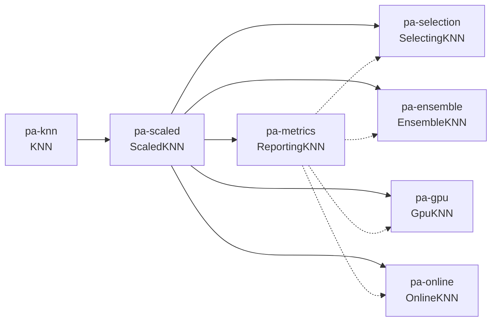

# ML Bootcamp

[](LICENSE)
[](https://docs.astral.sh/uv/)
[](https://docs.astral.sh/uv/)

A mentored sequence in **applied classification**. Students implement kNN
from scratch — no scikit-learn — then inherit that class through scaling,
metrics, model selection, ensembles, GPU/array work, and a drifting stream.

This repository is the **curriculum source**. Mentors copy it into a private
student repo inside an organization they own. Students never hand over a PAT.

| If you are… | Start here |
| --- | --- |
| **Looking around** | [What you will build](#what-you-will-build), then click into `issues/` and `learning/` |
| **The student** | Accept the org invite and open the [git](issues/00-git.md) issue. Work lives under `learning/` |
| **The mentor** | [docs/mentor.md](docs/mentor.md) — org rules, `deploy_student.sh`, review notes |

## Repository map

```text
.
├── README.md                 this page
├── docs/mentor.md            instantiate students, review PRs
├── issues/                   ticket text (opened as GitHub issues on deploy)
├── learning/                 student work tree; slugs match tickets
│   ├── load_assignment.py    later PAs import earlier classes
│   ├── pa-*/                 programming assignments (inherit KNN)
│   ├── ra-*/                 reading answers
│   ├── lr-*/                 literature responses
│   └── resources/data/       ARFF files
├── scripts/                  mentor: deploy, issues, branch rules
└── .github/                  PR template, commit lint
```

Ticket slugs match folders and Task names: `pa-knn`, `ra-scaling`,
`lr-jetson`. Table order is learning order.

## What you will build

kNN is the only algorithm students implement. Each programming assignment
**imports the previous class** and adds one facet.



`learning/load_assignment.py` loads an earlier assignment as a module.
Skeletons already call `import_pa('pa-knn')` (or `pa-scaled` / `pa-metrics`).
Keep the class names. Do not copy `kNN.py` into the next folder.

| You write | Class | Imports |
| --- | --- | --- |
| `pa-knn` | `KNN` | — |
| `pa-scaled` | `ScaledKNN(KNN)` | `pa-knn` |
| `pa-metrics` | `ReportingKNN(ScaledKNN)` | `pa-scaled` |
| `pa-selection` | `SelectingKNN(ScaledKNN)` | `pa-scaled` + `pa-metrics` |
| `pa-ensemble` | `EnsembleKNN(ScaledKNN)` | `pa-scaled` + `pa-metrics` |
| `pa-gpu` | `GpuKNN(ScaledKNN)` | `pa-scaled` + `pa-metrics` |
| `pa-online` | `OnlineKNN(ScaledKNN)` | `pa-scaled` + `pa-metrics` |

Required methods include a **sudo** comment: a vague sketch of the idea, not
runnable Python. Rewrite it yourself. Do not paste it as code.

## Assignments

Do them in **table order**. The slug is the ID. Ticket files are also listed
in [issues/README.md](issues/README.md).

| Ticket | Path | You leave behind |
| --- | --- | --- |
| [git](issues/00-git.md) | `learning/README.md` | first PR, review loop |
| [uv](issues/01-uv.md) | `learning/uv/` | uv + in-file deps |
| [taskfile](issues/02-taskfile.md) | `learning/taskfile/` | Task install + a small Taskfile |
| [ra-types](issues/03-ra-types.md) | `learning/ra-types/answers.md` | problem types for these files |
| [pa-knn](issues/04-pa-knn.md) | `learning/pa-knn/kNN.py` | class `KNN`, leave-one-out |
| [ra-scaling](issues/05-ra-scaling.md) | `learning/ra-scaling/answers.md` | why scale, how not to leak |
| [pa-scaled](issues/06-pa-scaled.md) | `learning/pa-scaled/kNN_scaled.py` | `ScaledKNN`, `--normalize`, `--task` |
| [pa-metrics](issues/07-pa-metrics.md) | `learning/pa-metrics/kNN_report.py` | `ReportingKNN`, baseline, plots |
| [ra-selection](issues/08-ra-selection.md) | `learning/ra-selection/answers.md` | validation vs test |
| [pa-selection](issues/09-pa-selection.md) | `learning/pa-selection/kNN_select.py` | `k` sweep, vote fractions |
| [ra-ensembles](issues/10-ra-ensembles.md) | `learning/ra-ensembles/answers.md` | bagging vs boosting |
| [pa-ensemble](issues/11-pa-ensemble.md) | `learning/pa-ensemble/kNN_ensemble.py` | bagged `ScaledKNN` |
| [ra-streaming](issues/12-ra-streaming.md) | `learning/ra-streaming/answers.md` | batch vs stream |
| [ra-hardware](issues/13-ra-hardware.md) | `learning/ra-hardware/answers.md` | what to put on a GPU |
| [pa-gpu](issues/14-pa-gpu.md) | `learning/pa-gpu/knn_gpu.py` | array / GPU `leave_one_out` |
| [ra-drift](issues/15-ra-drift.md) | `learning/ra-drift/answers.md` | drift + prequential |
| [ra-imbalance](issues/16-ra-imbalance.md) | `learning/ra-imbalance/answers.md` | imbalance that moves |
| [ra-cost](issues/17-ra-cost.md) | `learning/ra-cost/answers.md` | weighted `vote` |
| [pa-online](issues/18-pa-online.md) | `learning/pa-online/online_knn.py` | window + `--weighted-vote` |
| [lr-jetson](issues/19-lr-jetson.md) | `learning/lr-jetson/AI_Jetson_Survey.md` | edge literature |
| [lr-slam](issues/20-lr-slam.md) | `learning/lr-slam/ROS_Jetson_SLAM.md` | SLAM vs classification |

```bash
task uv
task taskfile
task knn
task scaled NORMALIZE=zscore TASK=binary
task metrics
task selection
task ensemble
task gpu
task online
task online:weighted
task generate-stream
```

Do not use scikit-learn (or similar) to implement the classifier.

## Student workflow

Do not push to `main`. Branch, PR, mentor review. Commits are
`type(scope): description` ([`.github/commit-convention.md`](.github/commit-convention.md)).
CI lints subjects on every PR.

Assignments are [uv](https://docs.astral.sh/uv/) **scripts**, not a project
venv. Each `learning/<slug>/…py` file starts with a [PEP 723](https://peps.python.org/pep-0723/)
header. `uv run that_file.py` reads **that file's** `requires-python` and
`dependencies`. There is nothing to activate.

Install Python 3.10+ and uv in the [uv](issues/01-uv.md) ticket, then Task
in the [taskfile](issues/02-taskfile.md) ticket. Then:

```bash
uv run learning/uv/hello.py
task uv
task knn
```

`task knn` is the same `uv run` with the flags from the root `Taskfile.yml`.
Students write their own Taskfile under `learning/taskfile/`; they do not
edit the root file.

Third-party packages are declared in the file that uses them (matplotlib in
`pa-metrics` / `pa-selection`; optional CuPy in `pa-gpu`'s header). Importing
an earlier script does **not** inherit its uv dependencies — re-list anything
you still call.

## Stretch goals

Every ticket has an optional stretch goal. Its job is to pose a harder
challenge after the required work is done — not to unlock the next
assignment.

- Skip any stretch you want. The next ticket never imports stretch methods
  and never requires `stretch.md`.
- Put stretch writeups in `learning/<assignment>/stretch.md` (or the extra
  heading in a reading's `answers.md`).
- Do not change required method names or the `none` / `zscore` / `minmax`
  contract to “finish” a stretch. Isolation is the point: a failed stretch
  must not break `pa-scaled` importing `pa-knn`.

## Data

See [`learning/resources/data/README.md`](learning/resources/data/README.md).

| File | Role |
| --- | --- |
| `small.arff` | default stationary set (Ecoli-style localization, 8 classes) |
| `medium.arff` | larger stationary set (white wine quality, 7 classes) |
| `large.arff` | stress / GPU comparison (same schema as `medium.arff`) |
| `small_stream.arff` | 800 instances, sudden drift at 400 (`pa-online`) |
| `medium_stream.arff` | 2000 instances, sudden drift at 1000 (`pa-online`) |

`learning/resources/generate_stream.py` rebuilds the stream files
(`task generate-stream`). Header comments document seed, drift index,
weights, and the label map.

## Mentors

Org setup, student deploy, and review notes live in
[docs/mentor.md](docs/mentor.md). How to change this source:
[CONTRIBUTING.md](CONTRIBUTING.md).
